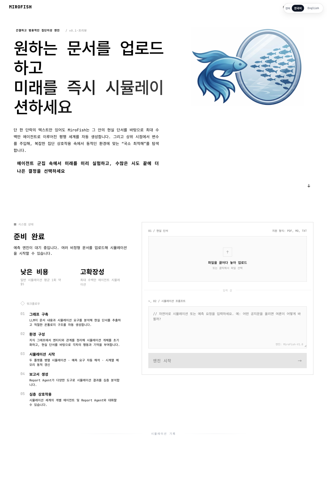
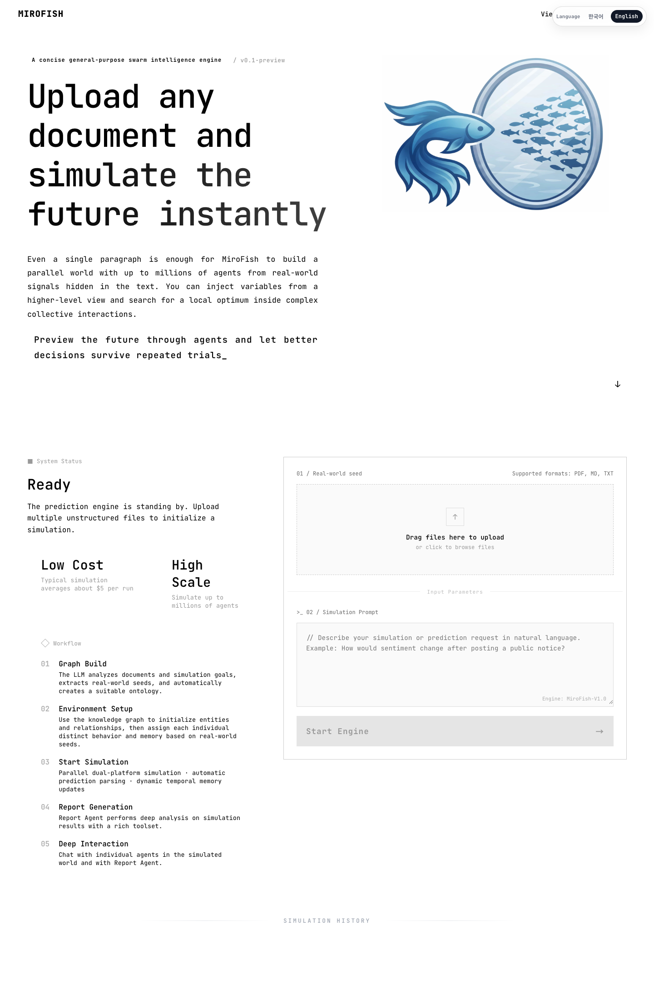
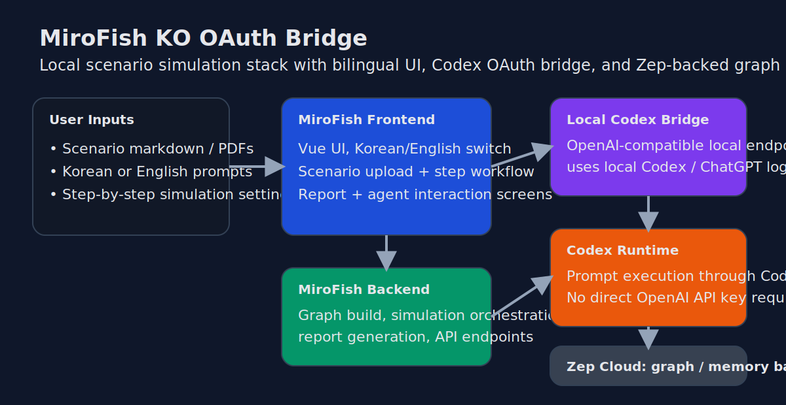

# MiroFish 한국어 OAuth 브리지 저장소

[](https://github.com/666ghj/MiroFish)
[](https://github.com/kochangbok/mirofish-ko-oauthbridge/releases)
[](./LICENSE)
[](./README.md)
[](./codex-bridge/README.ko.md)

[English](./README.md) | 한국어

> **하나의 저장소만 clone하면 된다.**  
> MiroFish 본체, 로컬 OAuth 브리지, 한영 문서와 UI, 바로 업로드 가능한 시나리오 예시를 한 번에 포함했다.

이 저장소는 **하나만 받으면 실행할 수 있게** 정리한 퍼블릭 공개용 올인원 리포지토리다.

포함된 것:
- MiroFish 본체(`frontend/`, `backend/`)
- 로컬 `codex-bridge/`
- 한국어 / 영어 UI와 사용 문서
- 테스트용 시나리오와 프롬프트 예시

즉, **upstream MiroFish와 별도 bridge 저장소를 따로 받을 필요가 없도록** 구성했다.

## 원작 / 출처 표시

이 프로젝트는 원본 [MiroFish](https://github.com/666ghj/MiroFish) 저장소와 원작자 **666ghj**의 작업을 바탕으로 만든 것이다.

> **비공식 배포판 안내**  
> 이 저장소는 개인이 로컬 실행 편의를 위해 재구성한 **비공식 수정/배포판**이다. 공식 MiroFish 저장소가 아니며, 원작자와 공식적으로 제휴하거나 승인받은 저장소도 아니다.

이 배포판에서 추가한 주요 내용:
- Codex 기본 경로와 실험적 Gemini 경로를 위한 `codex-bridge`
- 한국어 / 영어 UI 및 문서화
- 스타터 시나리오, 더 풍부한 프롬프트 예시, 다문서 시나리오 팩
- 공개 배포용 문서, 검증 노트, provider 설계 문서

## TL;DR

```bash
cp .env.example .env
npm install
./scripts/setup-public.sh
./scripts/run-all.sh
```

그 다음 브라우저에서:
- `http://localhost:3000`

추가로 필요한 것:
- 기본값 기준 `codex login` 완료 상태, 또는 Gemini 경로라면 로컬 Gemini CLI 로그인
- 본인 `ZEP_API_KEY`

### Gemini 재테스트 메모

**2026년 3월 15일** 기준으로 유지보수 환경에서 Gemini 경로를 실제로 다시 붙여 검증했다.
- headless Gemini CLI 단독 호출이 `GEMINI_BRIDGE_SMOKE_OK`를 반환
- 공개 브리지를 거친 호출이 `GEMINI_PUBLIC_BRIDGE_OK`를 반환

자세한 내용은 [Gemini 인증 재테스트 메모 (2026-03-15)](./docs/gemini-auth-retest-2026-03-15.md) 참고.

## 릴리즈 자료

- [Release announcement (English)](./docs/release-announcement-en.md)
- [릴리즈 소개문 (한국어)](./docs/release-announcement-ko.md)
- [Clone-to-run validation checklist (English)](./docs/validation-checklist-en.md)
- [Clone 후 실행 검증 체크리스트 (한국어)](./docs/validation-checklist-ko.md)
- [Upstream PR draft (English)](./docs/upstream-pr-draft-en.md)
- [Upstream issue draft (English)](./docs/upstream-issue-draft-en.md)
- [Gemini OAuth bridge design](./docs/gemini-oauth-bridge-design.md)
- [Gemini 인증 재테스트 메모 (2026-03-15)](./docs/gemini-auth-retest-2026-03-15.md)
- [Provider interface design](./docs/provider-interface.md)
- [Provider matrix](./docs/provider-matrix.md)
- [Claude API key provider design](./docs/claude-api-key-provider-design.md)
- [AWS Bedrock provider design](./docs/aws-bedrock-provider-design.md)
- [Google Vertex provider design](./docs/google-vertex-provider-design.md)
- [Release notes (English)](./docs/release-notes-en.md)
- [릴리즈 노트 (한국어)](./docs/release-notes-ko.md)

## 이 저장소가 다른 점

upstream MiroFish와 별도 bridge 저장소를 각각 clone하게 하지 않고, 이 저장소 하나에 아래를 모두 포함했다.
- MiroFish의 `frontend/`, `backend/`
- provider 선택이 가능한 로컬 OpenAI 호환 브리지 `codex-bridge/`
- 프론트엔드 한국어 UI 반영본
- 첫 실행용 문서와 예시

## 스크린샷

<table>
  <tr>
    <td width="50%"></td>
    <td width="50%"></td>
  </tr>
  <tr>
    <td align="center"><strong>한국어 홈 화면</strong></td>
    <td align="center"><strong>영어 홈 화면</strong></td>
  </tr>
</table>

### 브리지 playground UI


## 아키텍처



## 브리지 provider 옵션

- `BRIDGE_PROVIDER=codex` — 기본값, 가장 안정적인 경로
- `BRIDGE_PROVIDER=gemini` — Gemini CLI의 headless JSON 모드를 쓰는 실험적 로컬 provider
- `BRIDGE_PROVIDER=claude` — 이 공개판에서는 의도적으로 비활성화
- `codex:gpt-5.1-codex-mini`, `gemini:gemini-2.5-flash` 같은 provider가 붙은 모델명도 지원

> **왜 Claude를 막아두었나**  
> Anthropic 공식 문서에는 사전 승인 없이는 제3자 제품이 **claude.ai 로그인이나 rate limit**를 제공하면 안 된다는 취지의 제한이 있다. 그래서 이 퍼블릭 저장소에서는 Claude OAuth를 선택 가능한 공개 provider로 노출하지 않는다.

### 예정된 비-OAuth provider 설계

로컬 OAuth 세션 대신 API 키나 클라우드 인증으로 붙이고 싶은 사용자를 위해 아래 설계 문서를 함께 제공한다.

- [Provider matrix](./docs/provider-matrix.md)
- [Claude API key provider design](./docs/claude-api-key-provider-design.md)
- [AWS Bedrock provider design](./docs/aws-bedrock-provider-design.md)
- [Google Vertex provider design](./docs/google-vertex-provider-design.md)

## 빠른 시작

### 1. 준비물
- Node.js 18+
- Python 3.11 또는 3.12
- `uv`
- 기본 경로용 `codex` CLI, 또는 실험적 Gemini 경로용 Gemini CLI
- 기본값 기준 `codex login` 완료 상태
- 본인 `ZEP_API_KEY`

### 2. `.env` 준비
```bash
cp .env.example .env
```

그리고 아래 값을 채운다.
```env
LLM_API_KEY=local-oauth-bridge
LLM_BASE_URL=http://127.0.0.1:8787/v1
LLM_MODEL_NAME=gpt-5.1-codex-mini
ZEP_API_KEY=YOUR_ZEP_API_KEY_HERE
```

### 3. 전체 설치
```bash
npm install
npm run setup:public
```

또는:
```bash
./scripts/setup-public.sh
```

### 4. 전체 실행
```bash
PORT=8787 \
CODEX_MODEL=gpt-5.1-codex-mini \
CODEX_BRIDGE_WORKDIR=$(pwd) \
npm run dev:all
```

또는:
```bash
./scripts/run-all.sh
```

접속 주소:
- 프론트엔드: `http://localhost:3000`
- 백엔드: `http://localhost:5001`
- 브리지 playground: `http://127.0.0.1:8787/`
- 브리지 헬스체크: `http://127.0.0.1:8787/health`

### 5. 공개 대시보드 queue worker 실행

`/simulationadmin`에서 쌓인 요청은 **Vercel이 직접 처리하지 않고 로컬 worker가 처리**한다.

가장 쉬운 방법:

```bash
npm run dashboard:worker:auto
```

이 스크립트는 가능하면 `gh auth token`에서 GitHub 토큰을 자동으로 가져오고, 기본값으로 아래를 사용한다.
- owner: `kochangbok`
- repo: `mirofish-ko-oauthbridge`
- branch: `dashboard-data`
- backend: `http://127.0.0.1:5001`

## 포함된 스타터 시나리오

- **호르무즈 해협 긴장 / 한국 증시 반응**
- **카카오 오픈채팅 정책 공지 반발**
- **테슬라 코리아 리콜 / 브랜드 신뢰 충격**

경로:
- `examples/scenarios/ko/`
- `examples/scenarios/en/`
- `examples/prompts/ko/`
- `examples/prompts/en/`
- `examples/packs/ko/`
- `examples/packs/en/`

현재 포함된 상세 팩:
- `examples/packs/ko/hormuz-korea-2026-03-15/`
- `examples/packs/ko/kakao-openchat-policy-2026-03-15/`
- `examples/packs/ko/tesla-korea-recall-2026-03-15/`
- `examples/packs/en/hormuz-korea-2026-03-15/`
- `examples/packs/en/kakao-openchat-policy-2026-03-15/`
- `examples/packs/en/tesla-korea-recall-2026-03-15/`

## 첫 실행 추천

1. 먼저 `examples/scenarios/ko/` 또는 `examples/scenarios/en/`의 짧은 seed로 가볍게 시작한다
2. 그 문서 하나만 먼저 업로드한다
3. 대응되는 `examples/prompts/...` 프롬프트 하나를 붙여넣는다
4. 첫 실행은 라운드 수를 작게 잡는다
5. 더 촘촘한 시뮬레이션이 필요하면 `examples/packs/ko/` 또는 `examples/packs/en/`의 다문서 팩으로 넘어간다
6. Step4 보고서와 Step5 심층 상호작용을 확인한다
7. `docs/validation-checklist-ko.md` 체크리스트로 실제 동작을 점검한다

## 폴더 구조

- `frontend/`, `backend/` — MiroFish 본체
- `codex-bridge/` — provider 선택이 가능한 로컬 OAuth 브리지
- `docs/usage-guide-ko.md` — 한국어 사용 가이드
- `docs/usage-guide-en.md` — 영어 사용 가이드
- `docs/release-announcement-ko.md` — 한국어 릴리즈 소개문
- `docs/release-announcement-en.md` — 영어 릴리즈 소개문
- `docs/validation-checklist-ko.md` — 한국어 실행 검증 체크리스트
- `docs/validation-checklist-en.md` — 영어 실행 검증 체크리스트
- `docs/assets/` — 스크린샷과 아키텍처 다이어그램
- `examples/scenarios/` — 업로드용 시나리오 문서
- `examples/prompts/` — 시나리오별 프롬프트 예시
- `examples/packs/` — 더 상세한 다문서 시나리오 팩
- `scripts/setup-public.sh` — 설치 보조 스크립트
- `scripts/run-all.sh` — 브리지+백엔드+프론트 전체 실행
- `README-EN.md` — upstream 영어 문서 참고본
- `README-UPSTREAM-ZH.md` — upstream 중국어 문서 참고본

## 더 읽을 문서

- `docs/usage-guide-ko.md`
- `docs/usage-guide-en.md`
- `codex-bridge/README.ko.md`
- `codex-bridge/README.md`

## 중요한 한계

- 공식 OpenAI API 대체품이 아님
- 브리지는 **로컬 provider 로그인 세션**에 의존한다
- 퍼블릭 서버리스 배포용으로는 부적합하다
- Claude OAuth는 Anthropic의 제3자 제품 정책 제약 때문에 이 공개판에서 의도적으로 비활성화했다
- `ZEP_API_KEY`는 직접 준비해야 한다

## 릴리즈 흐름

- 소스 브랜치: `main`
- GitHub 릴리즈: [releases 페이지](https://github.com/kochangbok/mirofish-ko-oauthbridge/releases)
- 릴리즈 노트 원본: `docs/release-notes-en.md`, `docs/release-notes-ko.md`

## 라이선스

이 저장소는 AGPL 기반 MiroFish 코드와 파생 작업을 포함하므로 `LICENSE`와 `NOTICE.md`를 함께 제공한다.
