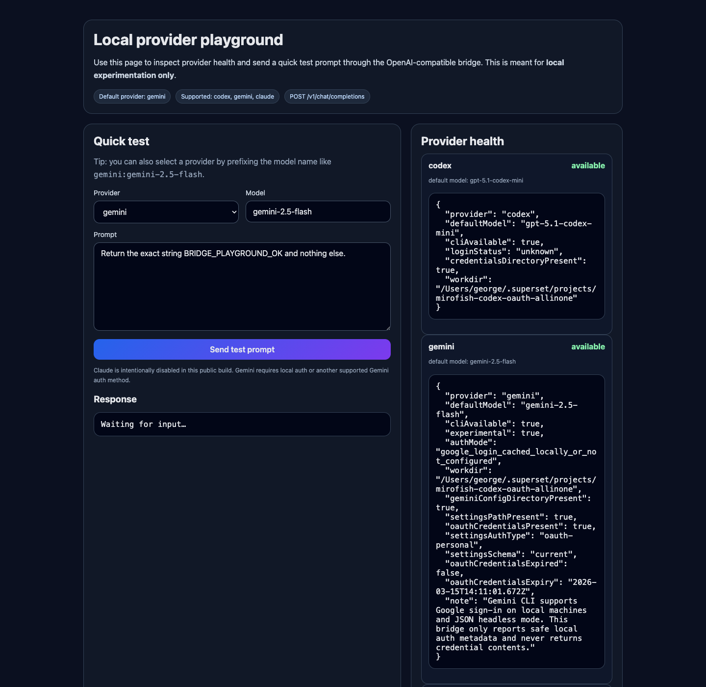

# codex-bridge

provider 선택이 가능한 최소 OpenAI 호환 `chat.completions` 브리지다.

## 지원 provider
- `codex` — 기본값이자 권장 경로
- `gemini` — 실험적 로컬 provider
- `claude` — 이 공개판에서는 의도적으로 비활성화

## 이 올인원 저장소 안에서 실행
```bash
cd codex-bridge
npm install
PORT=8787 \
BRIDGE_PROVIDER=codex \
CODEX_MODEL=gpt-5.1-codex-mini \
CODEX_BRIDGE_WORKDIR=/absolute/path/to/this/repository \
npm start
```

### 실험적 Gemini 경로
```bash
cd codex-bridge
npm install
PORT=8787 \
BRIDGE_PROVIDER=gemini \
GEMINI_MODEL=gemini-2.5-flash \
CODEX_BRIDGE_WORKDIR=/absolute/path/to/this/repository \
npm start
```

## 왜 필요한가
MiroFish는 OpenAI 호환 API를 기대한다. 이 브리지는 그 요청을 **로컬 OAuth 가능 CLI 세션**으로 넘겨준다.

## 엔드포인트
- `GET /` — 로컬 provider playground UI
- `GET /providers` — 전체 provider 상태 요약
- `GET /health` — 기본 또는 지정 provider 상태
- `POST /v1/chat/completions`

provider 선택은 `BRIDGE_PROVIDER`, 요청 JSON의 `provider` 필드, 또는 `gemini:gemini-2.5-flash` 같은 provider가 붙은 모델명으로도 제어할 수 있다.

## 설계 문서
- `../docs/provider-interface.md`
- `../docs/gemini-oauth-bridge-design.md`
- `../docs/gemini-auth-retest-2026-03-15.md`
- `../docs/provider-matrix.md`
- `../docs/claude-api-key-provider-design.md`
- `../docs/aws-bedrock-provider-design.md`
- `../docs/google-vertex-provider-design.md`

## Playground 스크린샷



## 한계
- 스트리밍 미지원
- 프로토타입 수준 동시성
- 로컬 실험용
- Claude OAuth는 Anthropic 문서의 제3자 제품 정책 제약 때문에 이 공개판에서 의도적으로 막아두었다
